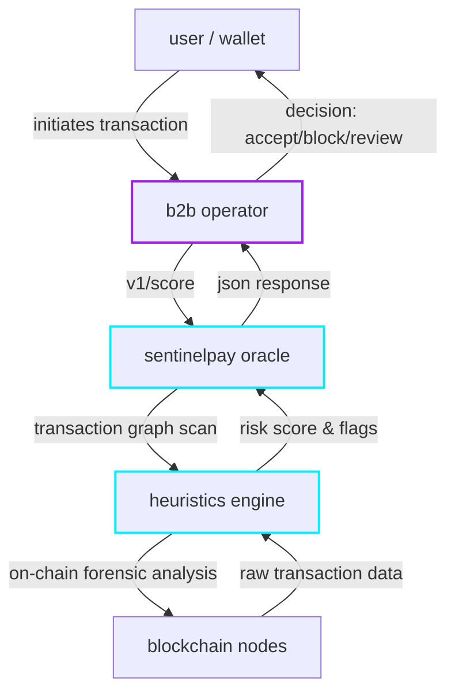

<p align="center">
  
</p>

<p align="center">
  <a href="https://github.com/ceemv22/sentinelpay/releases/latest"></a>
  <a href="https://sentinelpay.org"></a>
  <a href="https://x.com/sentinelpayorg"></a>
</p>

<h3 align="center">
  the security oracle for high-stakes crypto commerce.
</h3>

<p align="center">
  sentinelpay is a high-performance risk scoring engine designed to sit at the edge of the payment flow.
  it provides pre-deposit verification to protect treasury integrity.
</p>

---

## overview

sentinelpay is a real-time risk assessment protocol for decentralized commerce. unlike traditional aml tools that scan wallets after a transaction has occurred, sentinelpay enables b2b operators to assess wallet risk before accepting funds. this prevents the contamination of treasury accounts and ensures regulatory compliance at the gateway level.

the system utilizes a proprietary heuristics engine (v3.5) to perform deep forensic scans across multiple chains, identifying illicit patterns with sub-second latency.

## protocol architecture



## heuristics engine (v3.5)

our engine performs automated forensic analysis on normal, internal, and erc-20 transactions, reaching a depth of up to 10,000 operations per wallet.

| identifier | description | status |
|------------|-------------|--------|
| `sanctioned_entity` | direct correlation with ofac, mixers, or known illicit addresses. | active |
| `mixer_interaction` | inbound or outbound flow through coin mixers (140+ protocols supported). | active |
| `history_incomplete` | detection of history flooding (evasion attempts using 10k+ junk tx). | active |
| `high_velocity` | > 50 transactions broadcasted within a 24h rolling window. | active |
| `new_wallet` | on-chain deployment timestamp < 30 days. | active |
| `io_imbalance` | highly skewed inbound vs outbound capital ratios indicative of laundering. | active |

## security and compliance infrastructure

sentinelpay is built on an architecture of extreme security, ensuring that both the oracle and its users are protected from exploitation.

- **pre-execution verification**: scoring occurs at the edge, allowing operators to reject illicit funds before they are committed to the blockchain.
- **hybrid trust resolution**: integrated header verification for authenticated rate-limiting and tamper-proof audit logging.
- **atomic data integrity**: all internal states, including credit management and api provisioning, are handled via isolated acid-compliant transactions.
- **authenticated encryption**: sensitive data is protected using aes-256-gcm with versioned key rotation to ensure long-term data security.
- **zero-retention keys**: raw api keys are permanently erased from the system immediately after a one-time cryptographic reveal to the user.

## api integration

integration is designed to be seamless. utilize the sentinelpay api to secure your deposit gateway.

```bash
curl -x post https://api.sentinelpay.org/v1/score \
  -h "x-api-key: sp_live_xxxxxxxxxxxxxxxx" \
  -d '{"wallet": "0x..."}'
```

**example response:**

```json
{
  "wallet": "0x...",
  "score": 85,
  "category": "high",
  "flags": ["mixer_interaction", "history_incomplete"],
  "timestamp": "2026-05-11t20:21:00.000z"
}
```

## ecosystem

| node | url |
|------|-----|
| official portal | [sentinelpay.org](https://sentinelpay.org) |
| b2b dashboard | [sentinelpay.org/dashboard](https://sentinelpay.org/dashboard) |
| documentation | [help.sentinelpay.org](https://help.sentinelpay.org) |
| x / twitter | [@sentinelpayorg](https://x.com/sentinelpayorg) |

---
// sentinelpay // security by architecture.
