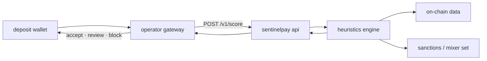

<p align="center">
  
</p>

<p align="center">
  <strong>pre-deposit wallet risk scoring for crypto treasuries</strong>
</p>

<p align="center">
  <a href="https://sentinelpay.org">sentinelpay.org</a>
  ·
  <a href="https://help.sentinelpay.org">docs</a>
  ·
  <a href="https://x.com/sentinelpayorg">@sentinelpayorg</a>
</p>

---

sentinelpay scores wallets **0–100** before funds reach your deposit address. call the api at the gateway, receive a risk score and signal flags, then accept, review, or block — no post-settlement aml lag.

built for high-throughput deposit flows: otc desks, crypto casinos, payment processors, and any treasury that cannot afford mixer or sanctioned exposure. supports ethereum, bnb chain, polygon, avalanche, arbitrum, optimism, base, solana, tron, and more.

## how it works



1. operator receives a deposit intent (address only).
2. sentinelpay pulls up to **10,000** normal, internal, and token transfers per wallet.
3. heuristics engine assigns score **0–100**, category, and flags.
4. operator enforces policy before broadcasting or crediting balance.

## risk signals

| signal | trigger | score impact |
|--------|---------|-------------|
| `sanctioned_entity` | address in ofac / mixer database | 100 (immediate) |
| `mixer_interaction` | inflow or outflow through known mixer contracts | +50 |
| `new_wallet` | first on-chain activity <30 days | +20 |
| `high_velocity` | >50 txs in a single day | +20 |
| `io_imbalance` | inbound/outbound ratio >10:1, min 10 txs | +10 |

categories: **low** (<30) · **medium** (30–59) · **high** (≥60)

`history_incomplete` is returned in the response (not scored) when the tx history reaches the 10k cap — possible flooding or evasion indicator.

mixer database: ~140 addresses, maintained from ofac and tornado sources (`scripts/update_mixers.py`).

## api

| tier | endpoint | auth | rate limit |
|------|----------|------|------------|
| b2b | `POST /v1/score` | `x-api-key` | 30 req / 15 min |
| public | `POST /v1/public/score` | cloudflare turnstile | 20 req / day (ip), 3 lifetime (fingerprint) |
| dashboard | `POST /v1/user/score` | supabase bearer jwt | credit-based |

production base: `https://sentinelpay.org/v1`

```bash
curl -X POST https://sentinelpay.org/v1/score \
  -H "Content-Type: application/json" \
  -H "x-api-key: sp_live_xxxxxxxxxxxxxxxx" \
  -d '{"wallet":"0x742d35Cc6634C0532925a3b844Bc9e695d487DA2"}'
```

```json
{
  "wallet": "0x742d35cc6634c0532925a3b844bc9e695d487da2",
  "score": 85,
  "category": "high",
  "flags": ["mixer_interaction"],
  "history_incomplete": false,
  "timestamp": "2026-05-23T00:00:00.000Z"
}
```

### other endpoints

| method | path | description |
|--------|------|-------------|
| `GET` | `/v1/user/profile` | profile + scan history |
| `GET` | `/v1/user/api-key/reveal` | reveal active api key |
| `POST` | `/v1/user/api-key/roll` | regenerate api key |
| `GET/POST` | `/v1/organizations` | list / create organizations |
| `GET` | `/v1/organizations/check` | check org name availability |
| `POST` | `/v1/organizations/:slug/team/invite` | send team invite |
| `POST` | `/v1/organizations/:slug/team/join` | accept team invite |
| `POST` | `/v1/stripe/checkout` | create stripe checkout session |
| `POST` | `/v1/stripe/webhook` | stripe webhook (raw body) |

full contract: [`docs/api.yaml`](docs/api.yaml)

## stack

| layer | tech |
|-------|------|
| api | node.js 22, express 5, prisma, postgresql |
| scoring engine | python 3, etherscan v2, 25s timeout |
| auth | supabase (dashboard users), sha-256 api keys (b2b) |
| billing | stripe (subscriptions + webhooks) |
| email | resend |
| cache / rate limiting | redis |
| edge | cloudflare (turnstile captcha, ip headers), helmet csp |

## repository

```
api/           rest api, dashboard static assets, stripe billing
engine/        score.py — on-chain heuristics
data/          mixers.json — sanctions / mixer address set
help-center/   documentation site (help.sentinelpay.org)
scripts/       mixer list updater
docs/          openapi spec
```

## run locally

```bash
cd api && npm install && npm run dev
```

required env vars: `DATABASE_URL`, `ETHERSCAN_API_KEY`, `SUPABASE_URL`, `SUPABASE_ANON_KEY`, `MASTER_ENCRYPTION_KEY`

production also needs: `REDIS_URL`, `STRIPE_SECRET_KEY`, `STRIPE_WEBHOOK_SECRET`, `RESEND_API_KEY`

docker:

```bash
docker build -t sentinelpay .
docker run -p 8080:8080 --env-file api/.env sentinelpay
```

## license

mit — see [LICENSE](LICENSE).
