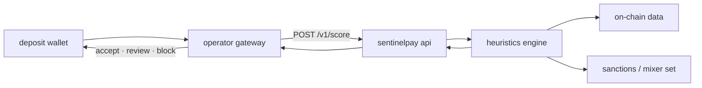

<p align="center">
  
</p>

<p align="center">
  <strong>pre-deposit wallet risk scoring for crypto treasuries</strong>
</p>

<p align="center">
  <a href="https://sentinelpay.org">sentinelpay.org</a>
  ·
  <a href="https://help.sentinelpay.org">docs</a>
  ·
  <a href="https://x.com/sentinelpayorg">@sentinelpayorg</a>
</p>

---

most aml tooling runs post-settlement. by then the funds have moved, the counterparty has withdrawn, and your compliance team is writing a sar. sentinelpay scores at the gateway — before you credit a balance, before you broadcast, before exposure becomes liability.

the api takes an address. it returns a score, a category, and the signals that drove it. your gateway enforces the policy. round-trip under 30 seconds.

## how it works



1. operator receives a deposit intent — address only, no funds move yet.
2. sentinelpay fetches up to 10,000 transactions: normal, internal, erc-20.
3. heuristics engine scores 0–100, assigns a category, surfaces flags.
4. operator enforces its own policy. sentinelpay never touches funds.

## risk signals

| signal | trigger | score impact |
|--------|---------|-------------|
| `sanctioned_entity` | address matched in ofac / mixer database | 100 — hard stop |
| `mixer_interaction` | direct inflow or outflow through known mixer contracts | +50 |
| `new_wallet` | first on-chain activity within 30 days | +20 |
| `high_velocity` | >50 transactions in a single day | +20 |
| `io_imbalance` | inbound/outbound ratio >10:1 across min. 10 txs | +10 |

**categories:** `low` (<30) · `medium` (30–59) · `high` (≥60)

`history_incomplete` surfaces when tx history hits the 10k cap — a possible flooding or evasion indicator. not scored, but returned so you can act on it.

mixer database: ~140 addresses covering ofac-listed entities and tornado cash derivatives, maintained via `scripts/update_mixers.py`.

**supported chains:** ethereum · bnb chain · polygon · avalanche · arbitrum · optimism · base · solana · tron

## api

```bash
curl -X POST https://sentinelpay.org/v1/score \
  -H "Content-Type: application/json" \
  -H "x-api-key: sp_live_xxxxxxxxxxxxxxxx" \
  -d '{"wallet":"0x742d35Cc6634C0532925a3b844Bc9e695d487DA2"}'
```

```json
{
  "wallet": "0x742d35cc6634c0532925a3b844bc9e695d487da2",
  "score": 85,
  "category": "high",
  "flags": ["mixer_interaction"],
  "history_incomplete": false,
  "timestamp": "2026-05-23T00:00:00.000Z"
}
```

| tier | endpoint | auth | rate limit |
|------|----------|------|------------|
| b2b | `POST /v1/score` | `x-api-key` | 30 req / 15 min |
| public | `POST /v1/public/score` | cloudflare turnstile | 20 req / day · 3 lifetime per fingerprint |
| dashboard | `POST /v1/user/score` | supabase bearer jwt | credit-based |

production base: `https://sentinelpay.org/v1` — full contract at [`docs/api.yaml`](docs/api.yaml)

## stack

| layer | tech |
|-------|------|
| api | node.js 22, express 5, prisma, postgresql |
| scoring engine | python 3, etherscan v2 |
| auth | supabase jwt (dashboard) · sha-256 key hashing (b2b) |
| billing | stripe subscriptions · native crypto via hd wallet derivation |
| rate limiting | redis |
| edge | cloudflare turnstile · helmet csp |

## repository

```
api/           node api, dashboard frontend, stripe + crypto billing
engine/        score.py — heuristics engine
data/          mixers.json — sanctions and mixer address set
scripts/       update_mixers.py
help-center/   help.sentinelpay.org
docs/          openapi spec
```

## running locally

```bash
cd api && npm install && npm run dev
```

minimum env: `DATABASE_URL` · `ETHERSCAN_API_KEY` · `SUPABASE_URL` · `SUPABASE_ANON_KEY` · `MASTER_ENCRYPTION_KEY`

production also requires: `REDIS_URL` · `STRIPE_SECRET_KEY` · `STRIPE_WEBHOOK_SECRET` · `RESEND_API_KEY` · `CRYPTO_MASTER_SEED`

## license

mit
