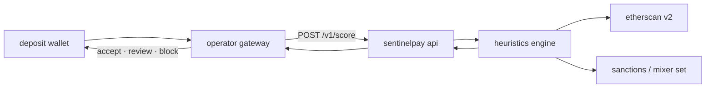

<p align="center">
  
</p>

<p align="center">
  <strong>pre-deposit wallet risk oracle for crypto treasuries</strong>
</p>

<p align="center">
  <a href="https://sentinelpay.org">sentinelpay.org</a>
  ·
  <a href="https://help.sentinelpay.org">docs</a>
  ·
  <a href="https://x.com/sentinelpayorg">@sentinelpayorg</a>
</p>

---

sentinelpay scores ethereum wallets **before** funds hit your deposit address. operators call the api at the gateway, get a risk score and signal flags, then accept, review, or block — no post-settlement aml lag.

built for high-throughput deposit flows: otc desks, crypto casinos, payment processors, and any treasury that cannot afford mixer or sanctioned exposure.

## how it works



1. operator receives a deposit intent (address only).
2. sentinelpay pulls up to **10,000** normal, internal, and erc-20 transfers per wallet via etherscan.
3. heuristics engine assigns score **0–100**, category, and flags.
4. operator enforces policy before broadcasting or crediting balance.

## risk signals

| signal | trigger |
|--------|---------|
| `sanctioned_entity` | wallet address in ofac / mixer database → score 100 |
| `mixer_interaction` | inflow or outflow through known mixer contracts |
| `history_incomplete` | tx history hits 10k cap (possible flooding / evasion) |
| `high_velocity` | >50 normal txs in 24h |
| `new_wallet` | first on-chain activity &lt;30 days |
| `io_imbalance` | inbound/outbound ratio &gt;10:1 |

categories: **low** (&lt;30) · **medium** (30–59) · **high** (≥60)

mixer database: ~140 addresses, maintained from ofac and tornado sources (`scripts/update_mixers.py`).

## api

| tier | endpoint | auth |
|------|----------|------|
| b2b | `POST /v1/score` | `x-api-key` |
| public | `POST /v1/public/score` | turnstile + rate limits |
| dashboard | `POST /v1/user/score` | supabase bearer jwt + credits |

production base: `https://sentinelpay.org/v1`

```bash
curl -X POST https://sentinelpay.org/v1/score \
  -H "Content-Type: application/json" \
  -H "x-api-key: sp_live_xxxxxxxxxxxxxxxx" \
  -d '{"wallet":"0x742d35Cc6634C0532925a3b844Bc9e695d487DA2"}'
```

```json
{
  "wallet": "0x742d35cc6634c0532925a3b844bc9e695d487da2",
  "score": 85,
  "category": "high",
  "flags": ["mixer_interaction"],
  "history_incomplete": false,
  "timestamp": "2026-05-23T00:00:00.000Z"
}
```

full contract: [`docs/api.yaml`](docs/api.yaml)

## stack

| layer | tech |
|-------|------|
| api + dashboard | node.js 22, express 5, prisma, redis |
| scoring engine | python 3, etherscan v2 (ethereum mainnet) |
| auth | supabase (dashboard), sha-256 api keys (b2b) |
| data | postgresql, audit logs |
| edge | cloudflare, helmet csp, rate limiting |

## repository

```
api/           rest api, dashboard static assets, stripe billing
engine/        score.py — on-chain heuristics
data/          mixers.json — sanctions / mixer address set
help-center/   documentation site (help.sentinelpay.org)
scripts/       mixer list updater
docs/          openapi spec
```

## run locally

```bash
cd api && npm install && npm run dev
```

requires `DATABASE_URL`, `ETHERSCAN_API_KEY`, `SUPABASE_URL`, `SUPABASE_ANON_KEY`, `MASTER_ENCRYPTION_KEY`. production also needs `REDIS_URL`.

docker:

```bash
docker build -t sentinelpay .
docker run -p 8080:8080 --env-file api/.env sentinelpay
```

## license

mit — see [LICENSE](LICENSE).
