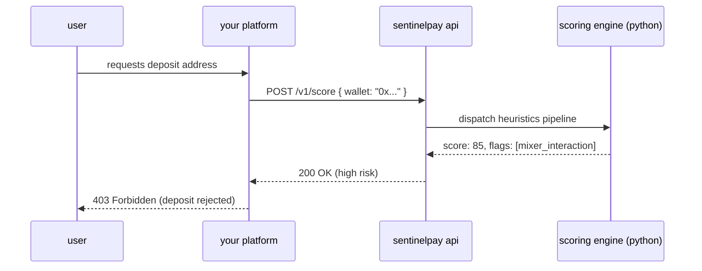

<p align="center">
  
</p>

<p align="center">
  <a href="https://github.com/ceemv22/sentinelpay/releases/latest"></a>
  <a href="https://sentinelpay.org"></a>
  <a href="https://x.com/sentinelpayorg"></a>
</p>

<h3 align="center">
  real-time risk decision engine for on-chain payment flows.
</h3>

<p align="center">
  stop illicit funds, sanction breaches, and mixer interactions <b>before</b> they hit your platform.<br>
  built for crypto casinos, otc desks, and high-risk merchants.
</p>

---

## the protocol

most crypto platforms evaluate risk retroactively. by the time a wallet is flagged, the deposit has already settled, triggering compliance breaches, frozen exchange accounts, and operational nightmares. 

**sentinelpay reverses this paradigm.** 

by sitting at the edge of your payment gateway, our engine evaluates the inbound wallet *before* generating a deposit address, providing an instant `0-100` risk score alongside actionable heuristics.

### architecture



---

## integration (b2b)

integration takes less than 5 minutes. grab your api key from the [dashboard](https://sentinelpay.org/dashboard) and inject it into your payment flow.

```bash
curl -X POST https://sentinelpay.org/v1/score \
  -H "content-type: application/json" \
  -H "x-api-key: sp_your_live_key_here" \
  -d '{"wallet": "0x742d35Cc6634C0532925a3b844Bc9e695d487DA2"}'
```

**response:**
```json
{
  "wallet": "0x742d35cc6634c0532925a3b844bc9e695d487da2",
  "score": 70,
  "category": "high",
  "flags": ["mixer_interaction", "high_velocity"],
  "timestamp": "2026-05-02T00:00:00.000Z"
}
```

---

## risk vectors (v3.0)

our proprietary engine analyzes deep historical data across eth, internal, and erc-20 token transfers.

| flag | heuristics applied | score penalty |
|------|--------------------|--------------|
| `sanctioned_entity` | absolute match in global ofac / high-risk entity database | `+100` |
| `mixer_interaction` | inbound/outbound interaction with tornado cash, sinbad, etc. | `+50` |
| `high_velocity` | > 50 transactions broadcasted within the last 24h window | `+20` |
| `new_wallet` | on-chain birth timestamp is < 30 days old | `+20` |
| `io_imbalance` | highly skewed inbound vs outbound capital ratio | `+10` |

> **note:** the engine employs a `0.001 eth` floor threshold for inbound mixer transactions to automatically mitigate dusting attacks and prevent false positives.

---

## enterprise security (s-tier certified)

we handle the security so you can handle the volume. sentinelpay is subjected to rigorous internal penetration testing.

- **zero data retention:** cleartext api keys are permanently erased (`api key sinkhole` architecture) immediately after the one-time user reveal.
- **race-condition immunity:** all billing and credit decrements are executed via atomic db transactions.
- **ddos resilience:** dual-layer fingerprinting + redis-backed sliding window rate limits.
- **xss & injection proof:** strict content-security-policy (csp) and hardened prisma orm implementation.

---

## self-hosting & local development

want to run the engine locally or contribute?

```bash
# 1. clone the repository
git clone https://github.com/ceemv22/sentinelpay.git
cd sentinelpay

# 2. install dependencies
npm install
pip install -r requirements.txt

# 3. set environment variables
cp api/.env.example api/.env
# populate: DATABASE_URL, REDIS_URL, ETHERSCAN_API_KEY, STRIPE_SECRET_KEY, SUPABASE_URL

# 4. push database schema
npx prisma db push

# 5. start the core
npm run dev
```

---

## ecosystem

| platform | link |
|----------|------|
| **production api** | `https://sentinelpay.org/v1` |
| **plg risk scanner** | [sentinelpay.org](https://sentinelpay.org) |
| **developer portal** | [sentinelpay.org/dashboard](https://sentinelpay.org/dashboard) |
| **x / twitter** | [@sentinelpayorg](https://x.com/sentinelpayorg) |

---
